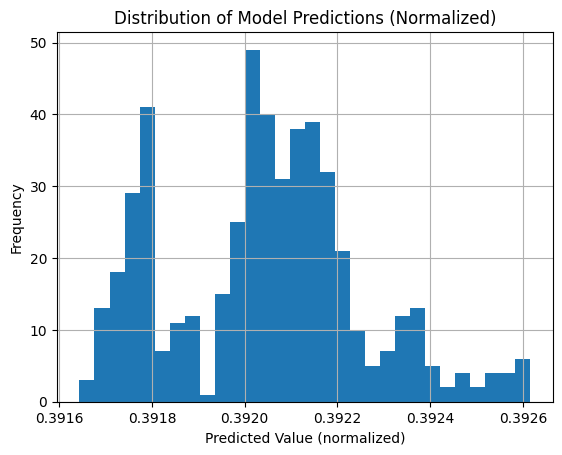

---
First get working hybrid
Then compare to my thesis 
maybe add more data 
build classic ML
compare hyper parameter's and setup to thesis
iterate

---
Issues encountered
- data normalization / window on stock options is a complex issue
- 
    The quantum circuit was making predictions in a very tight band, indicating the quantum layer isn't learning meaningful transformations

    lstm.weight_ih_l0 grad mean: 0.000000
lstm.weight_hh_l0 grad mean: 0.000000
Component	Behavior
quantum_out	Always [0.9999272, 0.99993163] — totally static
final output	Only slightly changes (depends on linear2)
gradients	All zero in lstm and linear1 layers
only linear2	Receives gradient and updates (after quantum layer)
🧠 What this tells us:
The quantum layer is completely ignoring its inputs

So: the issue is gradient flow is broken between your loss and your quantum circuit.

Fixed this through the function calll for inputs the data type of inputs and the type of activation function
this combination ReLu especially was forcing data to zero

-- 
Decided to create visuals for the Quantum circuit and the overall model
added dynamic logging of design and results to expirement and compare
Idea to make the model fully customizable like Terra's platform and dynamically log results 

---
Fixed a lot of issues with my orgina model
I added a random seed to ensure reproducability
I found out my model was not actually running a quantum layer because of the visualizer
easy fix by making the visual a copy of the model but this makes it run slower with the quantum layer
before optimization already good results lowest percentage error of 2.4%

made a folder for optimization 
make a python file with the data and hyperparameters call another that trains and tests the model

basically since I already have a good set up hyperparameters the goal is just to take the basline set
and loop through possible configurations one by one

1. First start by observing the effect of smaller larger quantum circuits
we expect to see larger circuits perform best, maybe up until some threshold or at least see diminishing returns 
this is simply more qubits large rhilbert space more tunable gates maps to more features a model can learn
but more features does not always mean better, so tune this and see the trend using a grid search 

2. Then loop through classical architecture
 - start with architecture configs like one lstm, 2 lstms, GRU 2 GRUs, combinations etc
 - see trends in archetecture
3. Activation function choices
 - loop through activation function choices
 - see what works before / after
3. sweep hyper parameters
 - sweep smaller details like learning rate, dropout rate etc

Then take all the best configs 
run the new and improved model yay