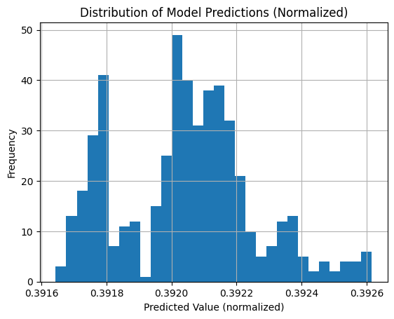

# 📈 Project Plan: Hybrid Quantum-Classical Time Series Forecasting

## Project Title
Time Series Forecasting Using Hybrid Quantum-Classical Models on Stock Market Data

## Objective
Develop and compare classical and hybrid quantum-classical models for time series forecasting using financial stock or options data. The aim is to explore the performance benefits of incorporating quantum circuits into standard ML forecasting pipelines.

---

## 1. Data Strategy

- **Data Source**: Use readily accessible or pre-existing datasets of company stock prices or stock options data.
- **Approach**:
  - Identify a suitable dataset (e.g., via Yahoo Finance, Kaggle, Quandl, or other public repositories).
  - Ensure the dataset includes time-indexed pricing data (e.g., open, close, volume).

---

## 2. Development Workflow

### 2.1 Phase 1: Classical Model Development

- **Initial Models**:
  - Start with RNN, LSTM, or GRU architectures
  - Leverage prior thesis work to guide model design and hyperparameter selection
- **Preprocessing**:
  - Normalize or scale time series data
  - Apply windowing techniques to prepare sequences
- **Training**:
  - Train classical models on historical stock data
  - Use standard forecasting metrics for evaluation (MAE, RMSE, etc.)

### 2.2 Phase 2: Hybrid Quantum-Classical Model

- **Integration**:
  - Add a quantum circuit layer (e.g., variational quantum circuit) to the classical model
  - Be open to restructuring parts of the classical model to better integrate the quantum component
- **Quantum Layer Design**:
  - Test different quantum circuit depths and architectures
  - Explore feature encoding strategies suitable for financial data
- **Optimization**:
  - Tune both classical and quantum hyperparameters for best hybrid performance

---

## 3. Evaluation and Comparison

- Train and evaluate both classical and hybrid models using consistent metrics
- Compare results graphically and numerically
- Record performance impacts introduced by the quantum layer
- Document observations and areas of improvement

---

## 4. Deliverables

- **Jupyter Notebook**: Complete implementation, including data preprocessing, models, training loops, and results
- **Report (1–2 Pages)**: Summary of methodology, findings, model decisions, and reflections on quantum contributions
- **Presentation (5–7 Minutes)**: Overview of work, challenges, and personal background

---

## Notes

- Parameter tuning and model architecture may evolve based on quantum integration needs
- Maintain flexibility in model design to experiment with novel ideas during development

---
First get working hybrid
Then compare to my thesis 
maybe add more data 
build classic ML
compare hyper parameter's and setup to thesis
iterate

---
Issues encountered
- data normalization / window on stock options is a complex issue
- 
    The quantum circuit was making predictions in a very tight band, indicating the quantum layer isn't learning meaningful transformations

    lstm.weight_ih_l0 grad mean: 0.000000
lstm.weight_hh_l0 grad mean: 0.000000
Component	Behavior
quantum_out	Always [0.9999272, 0.99993163] — totally static
final output	Only slightly changes (depends on linear2)
gradients	All zero in lstm and linear1 layers
only linear2	Receives gradient and updates (after quantum layer)
🧠 What this tells us:
The quantum layer is completely ignoring its inputs